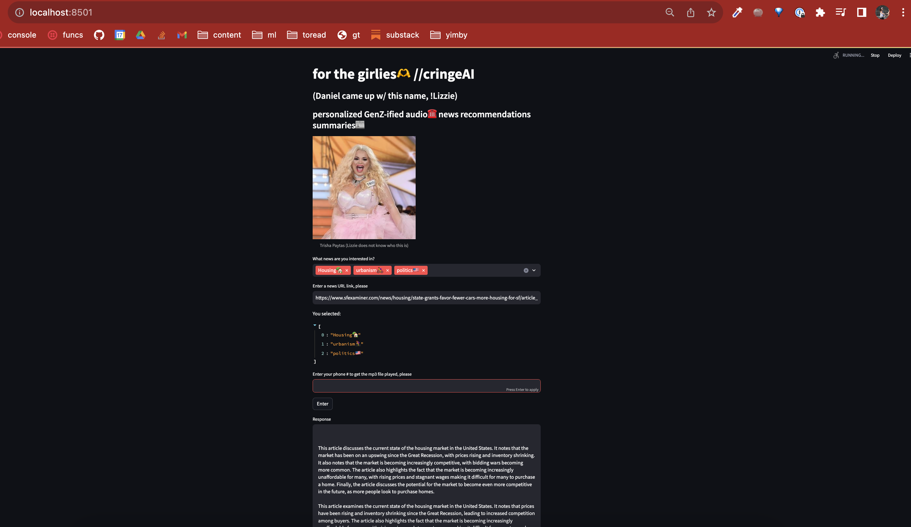
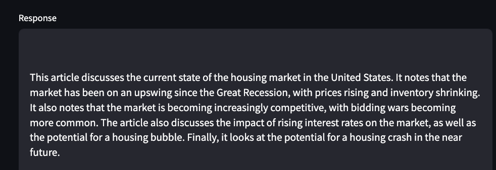
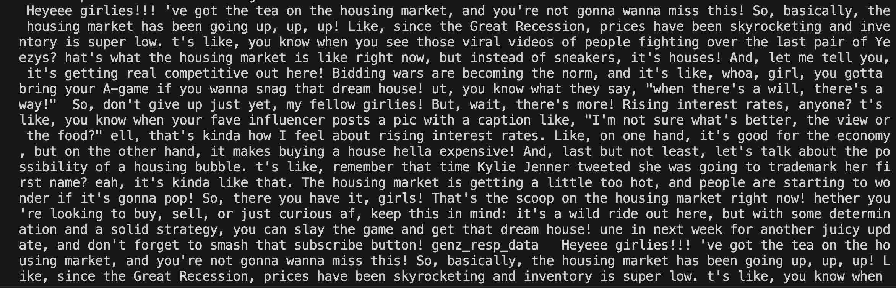

### 3rd place at Replicate AI Arts + Crafts Hackathon
#### Sunday, September 17, 2023

GenZ-ified news articles (recommended by Metaphor API) summarized and GenZ-ified (with LLaMA 2 on Replicate)to convert to speech (that was trained on Trisha Paytas's voice with Eleven Labs), upload to an AWS S3 bucket, play via a phone call (with Twilio Programmable Voice)

Made w/ ❤️ in SF w/ [Daniel Kim](https://twitter.com/learnwdaniel) and help from [Craig Dennis](https://twitter.com/craigsdennis). Thank you, [Replicate]!

